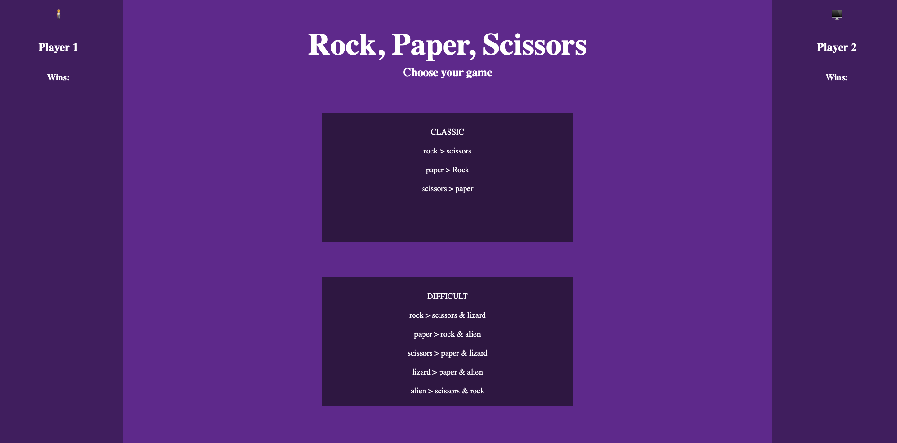

# Rock Paper Scissors

## Table of Contents
  - [Introduction](#introduction)
  - [Technologies](#technologies)
  - [Features](#features)
  - [Illustrations](#illustrations)
  - [Deployed Page](#deployed-page)
  - [Possible Future Extensions](#possible-future-extensions)
  - [Set Up](#set-up)
  - [Organizational Resources](#organizational-resources)
  - [Sources](#sources)
  - [Contributors](#contributors)
  - [Project Specs](#project-specs)

## Introduction
  - The purpose of this project was to allow students to practice some of the foundational concepts learned so far within the module. There are other extensions that test different skills that we can build on. The project allowed us to personalize/entertain different ideas with HTML/CSS as well as the functionality(JavaScript) behind the web page created.

## Technologies
  - Javascript
  - HTML
  - CSS

## Illustrations
  

## Features
- Choose a player, and check to see if you beat the computer!

## Deployed Page

Visit our published Hang In There Site! [here](https://connorcorc.github.io/rock-paper-scissors/)

## Possible Future Extensions
  - Persisting player wins on page reload would be awesome.
  - More enjoyable-to-look-at CSS

## Set Up

1. Fork this repo  
2. Clone the repo to your local machine
3. View the project in the browser by running open index.html in your terminal.

## Sources
  - [MDN](http://developer.mozilla.org/en-US/)
  - [W3Schools](https://www.w3schools.com/)

## Contributors
  - [Connor Corcoran](https://github.com/Connorcorc)

## Project Specs
  - The project spec & rubric can be found [here](https://frontend.turing.edu/projects/module-1/rock-paper-scissors-solo-v2.html)
